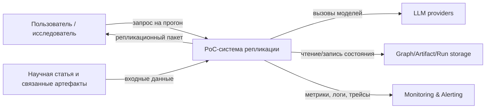
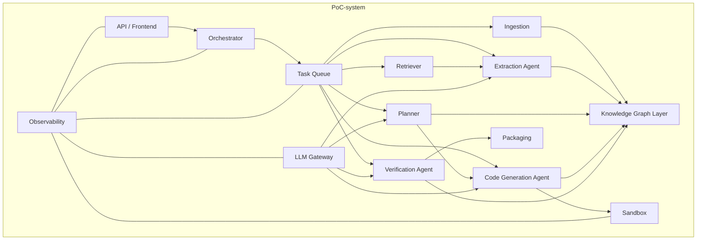
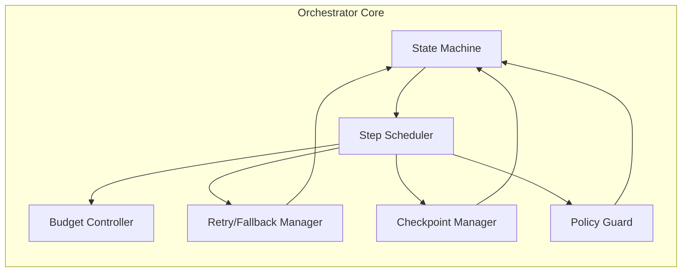
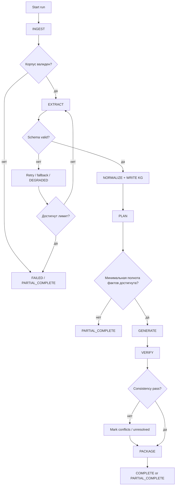
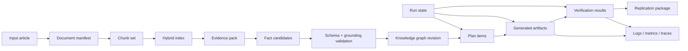

# Architecture Diagrams

Ниже приведены диаграммы в формате. Они описывают границы системы, контейнеры, внутреннее устройство ядра, execution flow и data flow.

## 1. C4 Context

## 2. C4 Container

## 3. C4 Component: ядро оркестрации

## 4. Workflow / graph diagram

## 5. Data flow diagram

